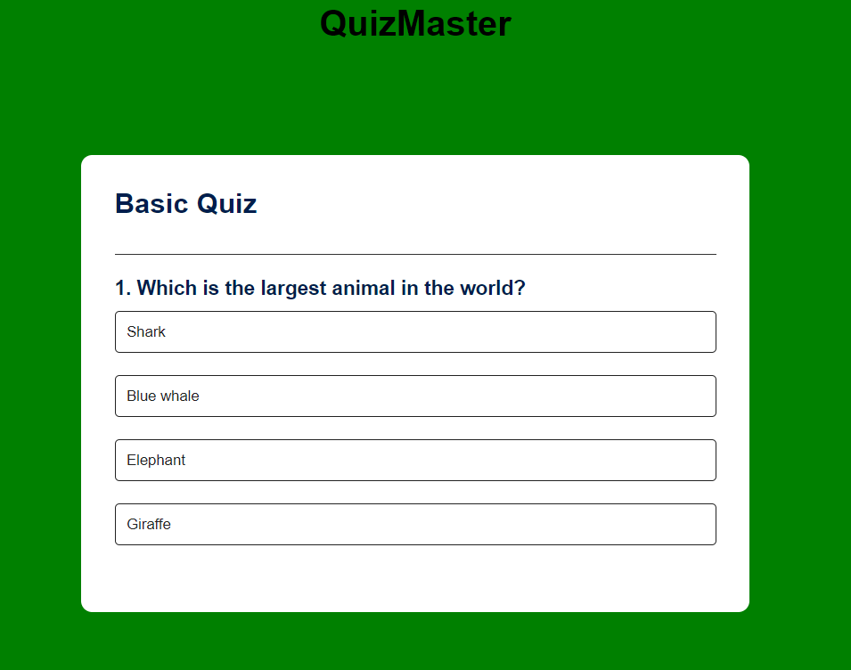

# QuizMaster App

Welcome to QuizMaster, your go-to platform for creating and taking quizzes with ease!

## Overview

QuizMaster is a web-based application designed to make quiz creation, management, and participation straightforward and enjoyable. Whether you're an educator, content creator, or just someone who loves quizzes, QuizMaster has you covered.

## Features

- **Create Quizzes:** Easily author quizzes with a user-friendly interface.
- **Customization:** Tailor your quizzes with various question types, themes, and settings.
- **Engaging User Experience:** Provide participants with an interactive and engaging quiz-taking experience.
- **Score Tracking:** Track and view scores in real-time.
- **Responsive Design:** Enjoy a seamless experience on both desktop and mobile devices.

## Getting Started

### Installation

To get started with QuizMaster, follow these steps:

1. Clone the repository: `git clone https://github.com/Scott-TechStar/quizmaster.git`
2. Navigate to the project directory: `cd quizmaster`
3. Open `index.html` in your preferred web browser.

### Usage

1. On the homepage, click "Create Quiz" to start crafting your quiz.
2. Customize your quiz by adding questions, choosing themes, and adjusting settings.
3. Save your quiz and share the unique quiz link with participants.
4. Participants can click the provided link to take the quiz.

## Contributing

We welcome contributions from the community! If you'd like to contribute to QuizMaster, please follow our [contribution guidelines](CONTRIBUTING.md).

## Support

For any issues, bug reports, or feature requests, please open an [issue](https://github.com/Scott-TechStar/quizmaster/issues).

## License

This project is licensed under the [MIT License](LICENSE).

---

Happy quizzing with QuizMaster!
